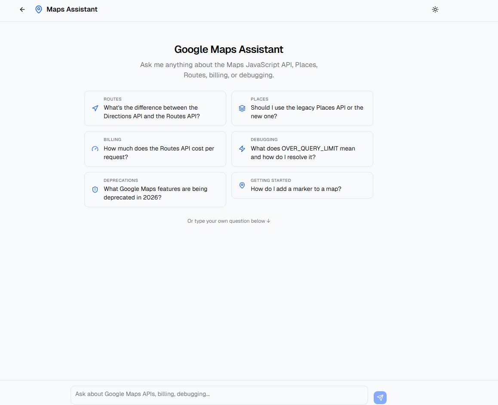

# Google Maps RAG Assistant

> AI-powered developer support for the Google Maps Platform. Every answer is grounded in official documentation with inline citations.

**Live demo:** [google-maps-rag-assistant.vercel.app](https://google-maps-rag-assistant.vercel.app) · **Architecture write-up:** [/architecture](https://google-maps-rag-assistant.vercel.app/architecture)



---

## What it is

A production-grade RAG (Retrieval-Augmented Generation) assistant that answers developer questions about the Google Maps JavaScript API, Places API, Routes API, billing, and troubleshooting. Unlike most chat wrappers, this one:

- **Never hallucinates pricing or product names** — retrieval is enforced by the system prompt; adversarial questions (e.g., "What's the pricing for the Google Maps Holographic API?") are refused, not fabricated.
- **Shows its work** — every answer includes a collapsible "Sources consulted" panel with cosine-similarity scores, so users see exactly which documentation chunks the model used.
- **Is measured, not vibes** — a 12-question eval suite with an LLM-as-judge scorer is committed to the repo. Every prompt or retrieval change is re-scored before it lands. See [`/evals`](./evals).

## Why I built this

I spent a year as a Tier 1 support engineer for the Google Maps Platform at HCLTech — triaging `RefererNotAllowedMapError`, explaining the $200 billing credit, debugging CORS issues, walking developers through `AdvancedMarkerElement` migrations. This is the tool I wish had existed: a single surface that gives developers accurate, cited answers to the questions support engineers answer the same way hundreds of times a week.

## Stack

| Layer | Choice | Why |
|---|---|---|
| Framework | Next.js 15 (App Router) | React Server Components, streaming, edge-compatible |
| LLM | `claude-sonnet-4-6` | Strong instruction-following, 1M-token context |
| Embeddings | `voyage-code-3` (1024-dim) | Anthropic's recommended provider, optimized for code-heavy docs |
| Vector DB | Neon Postgres + pgvector (IVFFlat cosine) | Serverless Postgres, edge-native driver, branching for safe re-ingestion |
| Streaming | Vercel AI SDK (`createUIMessageStream`) | Streams answers + custom data parts (sources) in one payload |
| UI | shadcn/ui + Tailwind + Framer Motion | |

## Architecture at a glance

```
Query
  → Voyage embedding (input_type=query)
  → Neon match_documents(top-5, threshold=0.65)
  → sources streamed to client as data part
  → claude-sonnet-4-6 generates answer with citation enforcement
  → streamed text merged onto same channel
```

Full pipeline + design decisions: [`/architecture` on the deployed site](https://google-maps-rag-assistant.vercel.app/architecture).

## Eval results

The repo includes a golden-question eval suite (`evals/`) covering happy-path retrieval, out-of-scope refusals, and adversarial hallucination bait. Every run writes a time-stamped markdown report to `evals/results/` so the git history shows quality trending over time.

| Run | Scorer | Prompt | Score | Notes |
|---|---|---|---|---|
| v1 | regex | system-prompt v1 | 7 / 12 (58%) | Baseline. 5 "failures" were scorer false negatives — correct refusals the regex didn't recognize. |
| v2 | LLM judge, strict schema | system-prompt v1 | 4 / 12 (33%) | Regressed because schema was too strict — surfaced a different bug. |
| v2.1 | LLM judge, loose schema | system-prompt v1 | 11 / 12 (92%) | Real signal. Remaining failure (q04) legitimate: answer listed deprecations but didn't anchor them to 2026 as asked. |
| v3 | LLM judge, loose schema | **system-prompt v2** | **12 / 12 (100%)** | Prompt v2 added explicit "anchor temporal claims to retrieved docs" + "empty retrieval ⇒ refuse" rules, closing the q04 gap. |

Two distinct iteration arcs are visible here: **v1 → v2.1** reflects *scorer* improvement (same model, same prompt — the score went up because we stopped mis-scoring correct answers). **v2.1 → v3** reflects *prompt* improvement (same scorer, but the prompt now handles a failure mode the first version missed).

Both arcs are committed run-by-run under `evals/results/` so the git history is an audit trail.

## Running locally

```bash
git clone https://github.com/Ramon-Carrillo/google-maps-rag-assistant.git
cd google-maps-rag-assistant
npm install
cp .env.example .env.local
# Fill in ANTHROPIC_API_KEY, VOYAGE_API_KEY, DATABASE_URL
```

### One-time database setup

```bash
# Apply schema (pgvector extension, documents table, match_documents function)
# Run the contents of src/lib/rag/migrations.sql against your Neon database
# via the Neon SQL editor, or:
psql "$DATABASE_URL" -f src/lib/rag/migrations.sql
```

### Ingest documents

```bash
npx tsx src/lib/rag/ingestion.ts
```

Re-running the ingestion script is idempotent: it deletes existing chunks by `source_url` before re-inserting. Add or edit Markdown files in `/documents` and re-run to refresh.

### Dev server

```bash
npm run dev
# visit http://localhost:3000
```

### Run the eval suite

```bash
npx tsx evals/run-evals.ts
# writes evals/results/<timestamp>.md + .json
```

## Project structure

```
src/
  app/
    page.tsx                  # landing page
    architecture/page.tsx     # design-decisions write-up
    maps-assistant/page.tsx   # chat interface
    api/chat/route.ts         # RAG endpoint (retrieval + streaming)
  components/maps-assistant/  # chat UI (ChatMessage, SourcesPanel, etc.)
  lib/
    anthropic.ts              # shared Claude client (explicit baseURL)
    rag/
      neon-client.ts          # Neon serverless driver wrapper
      voyage.ts               # Voyage embeddings client (with retry)
      retrieval.ts            # embedQuery + match_documents call
      ingestion.ts            # chunking + bulk embed + insert
      migrations.sql          # schema
  prompts/
    system-prompt.md          # versioned (edit here, not inline)
    citation-instructions.md
documents/                    # source Markdown (with YAML frontmatter)
evals/
  golden-questions.json       # 12 test questions
  run-evals.ts                # runner
  judge.ts                    # Haiku-based LLM judge
  results/                    # committed run outputs (audit trail)
```

## Cost

- **Voyage**: free tier covers 50M tokens/month on `voyage-code-3` — this project's usage is measured in thousands.
- **Claude Sonnet 4.6**: ~$0.03 per conversation turn at current retrieval settings (5 chunks × ~800 tokens each).
- **Neon**: free tier (0.5 GB storage, 191 compute-hours/month) is more than enough; autosuspend handles idle periods.
- **Expected monthly cost at moderate portfolio traffic**: < $5.

## Roadmap

- Prompt versioning with committed diffs (`v1 → v2 → v3`) and per-version eval scores
- Upstash-based distributed rate limiting (current in-memory limiter resets on cold start)
- Per-response cost telemetry in the UI
- Embedded live map for location-type queries

## Credits

Built by Ramon Montalvo. Informed by a year of Tier 1 Google Maps Platform support at HCLTech.
